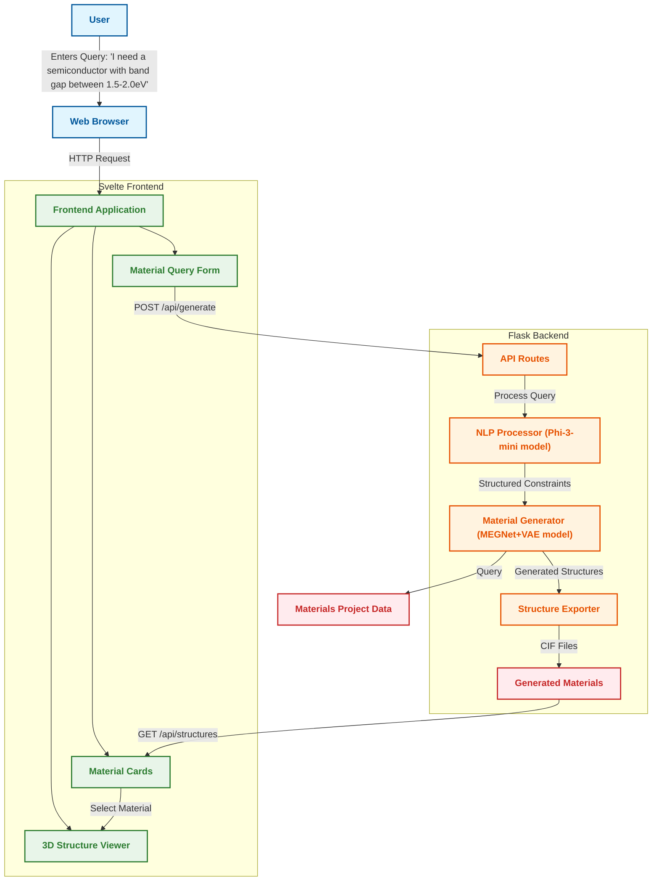
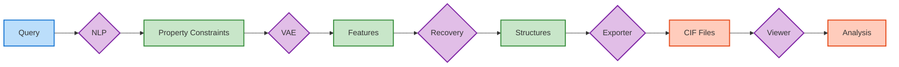

# MatGen: AI-Driven Materials Science

## Abstract

MatGen is an advanced material generation platform that leverages artificial intelligence to discover novel materials with tailored properties. By combining natural language processing with variational autoencoders (VAEs), the system translates user requirements expressed in plain language into specific material candidates with desired physical and chemical properties. The platform generates crystal structures that can be integrated directly into experimental workflows, bridging the gap between computational prediction and experimental validation in materials science. MatGen demonstrates how modern AI techniques can accelerate materials discovery by generating materials with targeted band gaps, formation energies, and mechanical properties.

## Project Description

### Overview

Materials discovery has traditionally been a time-consuming and resource-intensive process, relying on incremental improvements and extensive experimental testing. MatGen aims to revolutionize this approach by implementing a novel AI-driven pipeline that:

1. Takes natural language descriptions of desired material properties
2. Interprets these descriptions into quantifiable constraints
3. Generates novel crystal structures that satisfy these constraints
4. Provides 3D visualization and exportable structure files

The system consists of a Python backend for AI processing and materials generation, paired with a Svelte frontend for intuitive user interaction and 3D structure visualization.

### Datasets and Models

MatGen leverages several key components and datasets:

#### 1. Materials Project Database

The core dataset used to train the generative models comes from the Materials Project, a comprehensive repository of material properties calculated using density functional theory (DFT):

- **Size**: Contains over 140,000 inorganic compounds
- **Diversity**: Covers most known inorganic crystal structures in the ICSD (Inorganic Crystal Structure Database)
- **Property Calculations**: All materials have undergone rigorous DFT calculations using VASP (Vienna Ab initio Simulation Package)
- **Data Quality**: Curated and validated by materials science experts at Lawrence Berkeley National Laboratory

The specific properties extracted from the Materials Project for this system include:

- **Band Gap**: The energy difference between valence and conduction bands (in eV)
  - Critical for electronic and optical properties
  - Determines semiconductor vs. insulator behavior
  - Range in dataset: 0-10 eV

- **Formation Energy**: Energy released/required to form the compound from its elements (in eV/atom)
  - Indicator of thermodynamic stability
  - Lower values indicate more stable materials
  - Range in dataset: -20 to 5 eV/atom

- **Bulk Modulus**: Resistance to uniform compression (in GPa)
  - Mechanical property indicating stiffness/rigidity
  - Essential for structural applications
  - Range in dataset: 1-400 GPa

- **Crystal Structure Information**:
  - Space group and symmetry data
  - Atomic positions and lattice parameters
  - Bond lengths and angles
  - Chemical composition and stoichiometry

#### 2. Feature Engineering

Raw crystallographic data is transformed into a machine-learning-ready format:

- **Compositional Features**: 
  - Elemental statistics (atomic weights, radii, electronegativities)
  - Stoichiometric ratios
  - Elemental fractions
  - Oxidation states

- **Structural Features**:
  - Radial distribution functions
  - Angular distribution functions
  - Voronoi tessellation statistics
  - Local environment descriptors

- **Electronic Features**:
  - Orbital information
  - Electron configurations
  - Electron density distributions
  - Band structure representations

The combined feature space consists of 113 dimensions that comprehensively capture material characteristics across compositional, structural, and electronic domains.

#### 3. MEGNet+VAE Model

The Materials Exploration Graph Neural Network (MEGNet) combined with a Variational Autoencoder (VAE) processes this rich dataset:

- **Input Layer**: 113 dimensions (engineered material features)
- **Property Conditioning**: 3 dimensions (band gap, formation energy, bulk modulus)
- **Latent Space**: 16 dimensions (compressed material representation)
- **Neural Network Architecture**: [64, 32] hidden dimensions with ReLU activations

This architecture enables:
- Efficient exploration of vast chemical space
- Smooth interpolation between known materials
- Conditional generation based on desired properties
- Uncertainty quantification in generated structures

#### 2. NLP Processing Model

The natural language understanding component uses:

- **Microsoft Phi-3-mini-4k-instruct**: A lightweight but powerful language model for interpreting user queries
- **Custom Prompt Engineering**: Specialized prompts designed to extract material property constraints from natural language

### Approach

The system operates through a sophisticated multi-step pipeline:

1. **Natural Language Processing**:
   - User queries are processed by the Phi-3-mini model
   - A specialized prompt guides the model to extract key material properties and constraints
   - The system uses fallback rules for constraint extraction when necessary
   - Extracted property ranges are validated against realistic constraints

2. **Material Generation**:
   - The system translates property constraints into the VAE latent space
   - The VAE generates candidate material features with diversity control
   - A nearest-neighbor search identifies the closest known structures to the generated features
   - The system recovers and optimizes crystal structures based on these features

3. **Structure Processing and Visualization**:
   - Generated structures are exported as CIF (Crystallographic Information File) format
   - Material properties are calculated and mapped to visual representations
   - Interactive 3D visualization allows users to explore atomic arrangements

4. **Diversity and Realism Enhancement**:
   - Temperature parameter controls structural diversity
   - Previously generated structures are tracked to ensure diverse results
   - Validation against known physical constraints ensures realistic materials

## Architecture Diagram

## Workflow

The MatGen workflow involves several sequential steps that transform user inputs into tangible material structures:

### 1. User Interaction
Users interact with MatGen through an intuitive web interface where they:
- Input natural language descriptions of desired material properties
- Specify generation parameters, including:
  - **Number of samples**: Controls how many candidate materials to generate (1-10)
  - **Temperature**: Influences diversity of results (0.5-2.0), with higher values producing more diverse but potentially less accurate materials
- Choose from example queries or craft their own specific requirements
- Submit the query for processing through a single-click workflow

### 2. NLP Processing
The natural language query undergoes sophisticated processing:
- The query is sent to the Phi-3-mini model with specialized materials science prompting
- The NLP system identifies key property terms and numerical constraints
- It converts qualitative descriptions to quantitative ranges (e.g., "high conductivity" → specific conductivity range)
- The system extracts specific property ranges focusing on:
  - Band gap (electronically relevant)
  - Formation energy (stability relevant)
  - Bulk modulus (mechanically relevant)
- If direct NLP extraction fails, pattern-matching rules provide fallback constraint extraction
- The result is a structured constraints dictionary that quantifies the user's requirements

### 3. Material Generation
The constraints drive an AI-powered generation process:
- Property constraints are mathematically normalized for the VAE model
- The system samples multiple points within constraint boundaries to increase diversity
- The VAE model navigates a 16-dimensional latent space to identify viable material regions
- For each target property set, multiple candidate features are generated
- The structure recovery module performs nearest-neighbor search against known materials
- Diversity mechanisms prevent the system from repeatedly generating similar materials
- Each recovered structure includes:
  - Atomic positions and types
  - Unit cell parameters
  - Space group information
  - Chemical formula

### 4. Visualization and Analysis
The generated materials are presented through an interactive interface:
- Materials are displayed as cards with key properties for quick comparison
- Users can select materials to examine in detail
- The 3D structure viewer provides:
  - Multiple visualization styles (ball-and-stick, sphere, stick, line)
  - Element-specific coloring
  - Interactive rotation and zooming
  - Unit cell visualization
  - Atom-specific information on selection
- Detailed property information is displayed alongside the structure
- Users can download CIF files for further analysis in external tools
- The entire process from query to visualization typically completes in seconds

## Outcomes

MatGen successfully addresses several key challenges in computational materials discovery:

### 1. Natural Language Interface
- **Achievement**: Translates human language into precise material property constraints
- **Benefit**: Makes materials discovery accessible to researchers without specialized programming knowledge

### 2. Diverse Material Generation
- **Achievement**: Generates multiple candidate materials matching user requirements
- **Benefit**: Provides researchers with a range of options for experimental validation

### 3. Visualization Integration
- **Achievement**: Seamlessly integrates 3D visualization with generation capabilities
- **Benefit**: Enables intuitive understanding of complex crystal structures

### 4. Property-Targeted Design
- **Achievement**: Focuses generation on specific material properties (band gap, formation energy, bulk modulus)
- **Benefit**: Accelerates discovery of materials for targeted applications like semiconductors, batteries, and structural materials

### 5. Fast Prototyping
- **Achievement**: Generates and visualizes candidate materials in seconds rather than days/weeks
- **Benefit**: Dramatically speeds up the materials discovery lifecycle

## GitHub Repository

The complete codebase for MatGen is available at: [https://github.com/jaswanth1507/MatGen](https://github.com/jaswanth1507/MatGen)

## Technical Implementation Details

### Backend Components

#### NLP Processor
The NLP processor uses the Phi-3-mini model with custom prompt engineering to extract property constraints. The system employs specialized prompts that instruct the model to behave as a materials science expert, converting free-text queries into structured constraints. If the primary NLP extraction fails, a rule-based system provides fallback extraction using pattern-matching techniques to identify numerical ranges and property terms.

The NLP system is designed to understand a wide range of material science terminology, including:
- Property descriptions (semiconductor, conductor, insulator)
- Qualitative terms (high, low, moderate, excellent)
- Numerical specifications with units (eV, GPa, J/mol)
- Application-specific requirements (battery materials, photovoltaics)

#### Material Generator
The VAE-based material generator is the core computational engine of MatGen. It navigates the complex relationships between material structures and properties through a carefully designed latent space. The generation process involves:

1. **Target Selection**: Creating points within the user-specified constraint ranges
2. **Latent Space Sampling**: Using the VAE to generate feature vectors conditioned on target properties
3. **Diversity Enhancement**: Using temperature parameters to control exploration vs. exploitation
4. **Structure Recovery**: Mapping generated feature vectors to realizable atomic structures
5. **Post-processing**: Ensuring crystal validity and chemical feasibility

The "temperature" parameter plays a crucial role in controlling generation diversity - higher values promote exploration of novel material spaces, while lower values favor structures more similar to the training data.

### Frontend Components

#### Material Form
The user interface provides a simple yet powerful interface for material queries. It features:
- A free-text input area for natural language queries
- Numerical controls for generation parameters
- A set of example queries demonstrating the system's capabilities
- Immediate feedback during processing
- Error handling for failed queries

The form is designed to be accessible to researchers without requiring specialized knowledge of the underlying AI systems or programming.

#### Structure Viewer
The 3D structure viewer is built on the 3Dmol.js library and provides interactive exploration of generated crystal structures. Key features include:

1. **Multiple Visualization Styles**:
   - Ball and stick representation
   - Space-filling spheres
   - Wireframe models
   - Line representations

2. **Interactive Controls**:
   - Rotation and zooming
   - Element coloring options
   - Unit cell visualization toggle
   - Atom label display

3. **Structure Information**:
   - Formula and crystal system
   - Elemental composition
   - Atomic positions
   - Property predictions

4. **Element Details**:
   - Interactive atom selection
   - Element-specific information
   - Periodic table properties
   - Visualization of atomic properties

5. **Export Options**:
   - CIF file download
   - Property summary reports
   - Structure visualization snapshots

The viewer is designed to be responsive and performant even with complex crystal structures containing hundreds of atoms.

## Future Directions

MatGen provides a strong foundation for AI-driven materials discovery, with several promising directions for future development:

1. **Expanded Property Support**: Integrating additional material properties like thermal conductivity, electrical conductivity, and optical properties
2. **Multi-Model Approach**: Incorporating multiple generative models for different material classes
3. **Experimental Feedback Loop**: Adding capabilities to incorporate experimental validation results
4. **Active Learning**: Implementing continuous learning from user feedback and preferences
5. **Uncertainty Quantification**: Adding confidence metrics for generated materials
6. **Synthetic Experimentation**: Simulating experimental conditions to predict real-world performance

The current implementation serves as a powerful proof-of-concept, demonstrating the potential of AI to accelerate materials discovery and provide a more intuitive interface for materials researchers.
